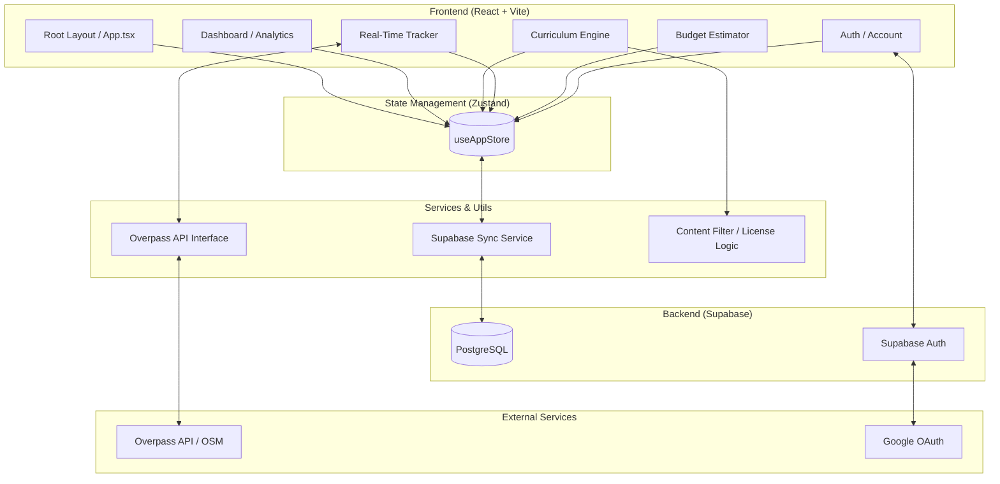

# DriveDE Architecture Documentation

## 🏗️ System Overview

DriveDE is a modern, real-time driving education and tracking application designed specifically for the German market. It bridges the gap between theoretical knowledge and practical driving experience by providing a structured curriculum, a real-time tracking engine with safety monitoring, and a comprehensive financial dashboard.

## 📊 Architecture Diagram

## 🧩 Key Components

### 1. Frontend Layer (React)
- **Root Orchestrator (App.tsx)**: Manages tab navigation, global layout (Mobile vs Desktop), and initializes the authentication heartbeat.
- **Curriculum Engine**: Dynamically filters content from a static data source based on whether the user is on a "Standard" path or "Conversion" (Umschreibung) and their transmission type (Manual vs Automatic).
- **Real-Time Tracker**: The most complex component. It utilizes the browser's Geolocation API alongside the **Overpass API** to perform spatial queries. It detects:
    - Stop sign violations.
    - Wrong-way driving (via road bearing comparison).
    - Illegal turns (where prohibited by road geometry).
- **Financial Dashboard**: Uses 45-minute "Fahrstunde" units and German-specific rate factors to estimate current spend and project future license costs.

### 2. State Management (Zustand)
- **useAppStore**: Acts as the single source of truth for the entire application. It manages:
    - User settings (Language, Dark Mode, License Type).
    - Progress (Completed lessons, quiz scores).
    - Session history (Driving routes, mistakes, distance).
- **Persistence**: Automatically persists state to `localStorage` via Zustand middleware, ensuring that visitors who aren't logged in don't lose their progress.

### 3. Synchronization Layer
- **supabaseSync.ts**: A critical service that triggers every time the state changes. It performs "upserts" to keep the cloud database in sync with the local store. 
- **Offline Resilience**: Because the state is held in Zustand/LocalStorage, the app remains functional in areas with poor cellular reception (common during driving sessions) and syncs once the connection is restored.

### 4. Backend (Supabase)
- **Database**: PostgreSQL handles structured data for profiles, driving sessions, and detailed lesson progress.
- **Authentication**: Managed via Supabase Auth, supporting traditional email/password and Google OAuth.

### 5. Utilities
- **Content Filters**: Decoupled logic to ensure the correct "German Driving School" rules are applied to the curriculum based on the license type selection.
- **Geospatial Utils**: Functions for calculating bearings, distances (Haversine formula), and road geometry comparisons.

## 🛠️ Technology Stack

| Layer | Technology |
| :--- | :--- |
| **Framework** | [React](https://reactjs.org/) + [Vite](https://vitejs.dev/) |
| **Styling** | [Tailwind CSS](https://tailwindcss.com/) + [Vanilla CSS](https://developer.mozilla.org/en-US/docs/Web/CSS) |
| **Animations** | [Framer Motion](https://www.framer.com/motion/) |
| **Icons** | [Lucide React](https://lucide.dev/) |
| **State** | [Zustand](https://github.com/pmndrs/zustand) |
| **Backend** | [Supabase](https://supabase.com/) |
| **External API** | [Overpass API](https://overpass-api.de/) (OpenStreetMap) |

---
*Last Updated: April 2026*
